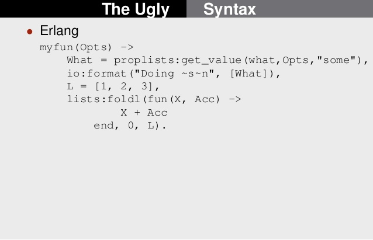
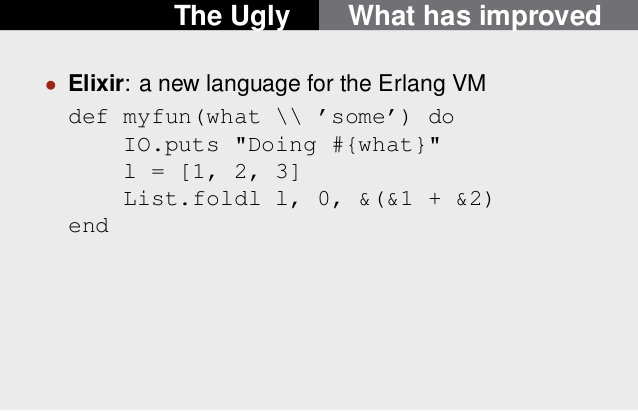

Introdução ao Elixir
===========================

# História

 Elixir é uma linguagem de programação funcional, concorrente, de propósito geral que roda em cima da Erlang virtual machine (BEAM). Desenvolvida por um brasileiro "José Valim - Plataformatec".  

fonte: https://en.wikipedia.org/wiki/Elixir_(programming_language)

Erlang foi criada dentro da Ericsson, pelo Joe Armstrong em 1986. Virou open source em 1998.

Principais características:
- Distributed
- Fault-tolerant
- Soft real-time (garantir tempo de resposta)
- Highly available, non-stop applications
- Hot swapping, where code can be changed without stopping a system.

Propriedades da linguagem:
- Immutable data
- Pattern matching
- Functional programming

Erlang é apenas a linguagem (VM) por trás do Whatsapp, 50 engenheiros para 90 milhões de usuários. 

fonte: 
https://en.wikipedia.org/wiki/Erlang_(programming_language)
https://www.wired.com/2015/09/whatsapp-serves-900-million-users-50-engineers/
https://www.fastcompany.com/3026758/inside-erlang-the-rare-programming-language-behind-whatsapps-success

## Erlang code - ugly



## Elixir - sintaxe mais amigável



## Phoenix "roubou" diversos desenvolvedores Rails. As similaridades de sintaxe do Elixir com o Ruby e as características de alta concorrência e escalabilidade providas pelo Erlang, tornaram o Elixir/Phoenix uma evolução natural para os desenvolvedores Ruby/Rails.

fonte: https://smashingboxes.com/blog/choosing-your-future-tech-stack-clojure-vs-elixir-vs-go/

## 2 milhões de WebSocket conexões com Phoenix


fonte: https://phoenixframework.org/blog/the-road-to-2-million-websocket-connections

Este material é baseado https://elixirschool.com/en, versão em Português https://elixirschool.com/pt (pode estar desatualizada)

# Instalação

Seguir o guia da página oficial https://elixir-lang.org/install.html ou https://elixirgirls.com/install-guides/windows.html

# Shell - iex

```elixir
iex(1)> 2 + 3
5
iex(2)> 2 + 3 == 5
true
iex(3)> String.length("UFRA - ICIBE")         
12
```

# Tipos de dados: Integer, Float, Boolean, Atoms, Strings
```elixir
iex(4)> 25 
25
iex(5)> 5.6
5.6
iex(6)> true
true
iex(7)> false
false
iex(8)> :constante
:constante
iex(9)> :ufra
:ufra
iex(10)> is_atom(:ufra)
true
iex(11)> :ufra |> is_atom # passa :ufra como 1 parametro para a função seguinte
true
iex(12)> "ufra"
"ufra"
iex(13)> "ufra" == :ufra
false
iex(14)> String.to_atom("ufra") == :ufra
true
```

# Variáveis e operadores lógicos
```elixir
iex(15)> x = 12
12
iex(16)> x > 12 and x <= 20
false
iex(17)> x > 12 or x <= 20 
true
iex(18)> x == 12 
true
iex(19)> x === 12.0
false
iex(20)> x == 12.0 
true
iex(21)> x != 12
false
```

# Interpolação e concatenação de Strings
```elixir
iex(22)> x = "ICIBE"
"ICIBE"
iex(23)> "Ufra - #{x}"
"Ufra - ICIBE"
iex(24)> "Ufra -" <> x
"Ufra -ICIBE"
```

# Lists
Estrutura genérica, de tamanho variável que pode conter elementos dos mais variados tipos. 

```elixir
iex(32)> lista = [12, :ufra, "icibe"]
[12, :ufra, "icibe"]
```

# Concatenar Lists
```elixir
iex(34)> lista ++ [3.4]
[12, :ufra, "icibe", 3.4]
iex(35)> lista # não alterou a variável lista
[12, :ufra, "icibe"]
# guardando nova lista
iex(36)> lista2 = lista ++ [3.4]
[12, :ufra, "icibe", 3.4]
```

# Subtrair Lists
```elixir
iex(37)> [1,2,3,4,5] -- [1,2,6]
[3, 4, 5]
iex(38)> [1,1,2,2,3] --[1,2,3] 
[1, 2]
iex(39)> ["foo", :bar, 42] -- [42, "bar"]
["foo", :bar]
```

# Head | Tail (muito usado...)
```elixir
iex(40)> x = [1,2,3,4,5]
[1, 2, 3, 4, 5]
iex(41)> hd(x)
1
iex(42)> tl(x)
[2, 3, 4, 5]
iex(43)> [h|t] = x # pattern matching
[1, 2, 3, 4, 5]
iex(44)> h
1
iex(45)> t
[2, 3, 4, 5]
```

# Tuples
Tuples são estruturas que são armazenadas num espaço continuo de memória (diferente das Lists), o que torna o acesso to tamanho muito rápido e alterações custoso. Uma nova tupla tem que ser copiada inteira na memória. Muito utilizada em retorno de funções.

```elixir
iex(46)> {:ok, 12}
{:ok, 12}
iex> File.read("path/to/existing/file")
{:ok, "... contents ..."}
iex> File.read("path/to/unknown/file")
{:error, :enoent}    
```

# Keyword Lists

Keyword Lists é um tipo especial de List. Lista de tuplas onde o primeiro elemento da tupla é um atom. 

```elixir
iex> [foo: "bar", hello: "world"]
[foo: "bar", hello: "world"]
iex> [{:foo, "bar"}, {:hello, "world"}]
[foo: "bar", hello: "world"]
```

Características:

1 - Keys são atoms;
2 - Keys são ordenadas;
3 - Keys não precisam ser únicas.

Por causa destas características, são usualmente utilizadas para passar parâmetros para funções.

# Maps

Maps são estrutura Hash que permite uma coleção key-value. Permite que a key seja de qualquer tipo e não são ordenadas. 

```elixir
iex> map = %{:foo => "bar", "hello" => :world}
%{:foo => "bar", "hello" => :world}
iex> map[:foo]
"bar"
iex> map["hello"]
:world
```

- Não é permitido duplicação de chave.

```elixir
iex> %{:foo => "bar", :foo => "hello world"}
%{foo: "hello world"}
```

- sintax especial quando todas as key são atoms
```elixir
iex> %{foo: "bar", hello: "world"}
%{foo: "bar", hello: "world"}
iex> %{foo: "bar", hello: "world"} == %{:foo => "bar", :hello => "world"}
true
iex> map.hello
"world"
```

# Pattern Matching

O operador = é na verdade um operador de correspondência (match operator), seria o mesmo que o operador = na matemática. Elixir faz o match se o valor da esquerda é igual ao da direita. Se o Match der certo ele retorna o valor da operação, caso contrário retorna um erro.

```elixir
iex(47)> x = 1
1
iex(48)> 1 = x
1
iex(49)> 2 = x
** (MatchError) no match of right hand side value: 1
    (stdlib) erl_eval.erl:453: :erl_eval.expr/5
    (iex) lib/iex/evaluator.ex:257: IEx.Evaluator.handle_eval/5
    (iex) lib/iex/evaluator.ex:237: IEx.Evaluator.do_eval/3
    (iex) lib/iex/evaluator.ex:215: IEx.Evaluator.eval/3
    (iex) lib/iex/evaluator.ex:103: IEx.Evaluator.loop/1
    (iex) lib/iex/evaluator.ex:27: IEx.Evaluator.init/4
```

Matching com lista
```elixir
iex(49)> lista = [1, 2, 3]  
[1, 2, 3]
iex(50)> [1, 2, 3] = lista
[1, 2, 3]
iex(51)> [1, 2] = lista
** (MatchError) no match of right hand side value: [1, 2, 3]
    (stdlib) erl_eval.erl:453: :erl_eval.expr/5
    (iex) lib/iex/evaluator.ex:257: IEx.Evaluator.handle_eval/5
    (iex) lib/iex/evaluator.ex:237: IEx.Evaluator.do_eval/3
    (iex) lib/iex/evaluator.ex:215: IEx.Evaluator.eval/3
    (iex) lib/iex/evaluator.ex:103: IEx.Evaluator.loop/1
    (iex) lib/iex/evaluator.ex:27: IEx.Evaluator.init/4
iex(51)> [1, 2, aux] = lista
[1, 2, 3]
iex(52)> aux
3
iex(53)> [1, 2, _] = lista # _ ignora a variável
[1, 2, 3]
iex(54)> [1 | tail] = lista
[1, 2, 3]
iex(55)> tail
[2, 3]
```

## Pin operator

Algumas vezes reatribuir o valor a variável não é um comportamento desejável (Erlang way).

```elixir
iex(57)> x = 1
1
iex(58)> ^x = 2
** (MatchError) no match of right hand side value: 2
    (stdlib) erl_eval.erl:453: :erl_eval.expr/5
    (iex) lib/iex/evaluator.ex:257: IEx.Evaluator.handle_eval/5
    (iex) lib/iex/evaluator.ex:237: IEx.Evaluator.do_eval/3
    (iex) lib/iex/evaluator.ex:215: IEx.Evaluator.eval/3
    (iex) lib/iex/evaluator.ex:103: IEx.Evaluator.loop/1
    (iex) lib/iex/evaluator.ex:27: IEx.Evaluator.init/4
iex(58)> x = 2
2
```

# Estruturas de Controle

## if e unless

```elixir
iex(60)> if is_integer("0") do
...(60)>  "int"   
...(60)> else 
...(60)>  "not int"
...(60)> end
"not int"
```

Apenas nil e false são considerados falso realmente.

```elixir
iex(61)> if "ufra" do
...(61)>  "true" 
...(61)> else 
...(61)>  "false"
...(61)> end
"true"
```

Unless if negado

```elixir
iex(62)> unless "ufra" do
...(62)>   "false"
...(62)> else
...(62)>   "true"
...(62)> end
```

## case

Quando é necessário testar VALORES contra vários critérios.

```elixir
iex(67)> x = {:ok, 12}
{:ok, 12}
iex(68)> case x do
...(68)>     {:ok, var} -> "Tudo certo #{var}"
...(68)>     {:error, e} -> "Error: #{e}"
...(68)>     _ ->  "Catch all"
...(68)> end   
"Tudo certo 12"
```

## cond

Quando é necessário testar CONDIÇÕES contra vários critérios.

```elixir
x = 13
cond do
  is_integer(x) -> "int"
  is_binary(x) -> "string" # testa se é String
  true -> "outra coisa"
end
```

## with

Muito usado pelos Controllers no Phoenix (importante). É útil para substituir vários CASE um dentro do outro (nested case).

```elixir
iex(88)> user = %{first: "Sean", last: "Callan"}
%{first: "Sean", last: "Callan"}
iex(90)> Map.fetch(user, :first) # função auxiliar para pegar um valor de um Map 
{:ok, "Sean"}
iex(91)> with {:ok, first} <- Map.fetch(user, :first),
...(91)>      {:ok, last} <- Map.fetch(user, :last),
...(91)> do: last <> ", " <> first
"Callan, Sean"     
```

Se qualquer um dos testes do with falhar...

```elixir
iex(94)> user = %{first: "Sean"}
%{first: "Sean"}
iex(95)> %{first: "Sean", last: "Callan"}
%{first: "Sean", last: "Callan"}
iex(96)> Map.fetch(user, :first) # função auxiliar para pegar um valor de um Map 
{:ok, "Sean"}
iex(97)> with {:ok, first} <- Map.fetch(user, :first),
...(97)>      {:ok, last} <- Map.fetch(user, :last),
...(97)>      do: last <> ", " <> first
:error     
```

# Funções

## Funções Anônimas

Todo em Elixir é baseado em funções.

```elixir
iex(101)> sum = fn (a, b) -> a + b end
#Function<12.128620087/2 in :erl_eval.expr/5>
iex(102)> sum.(2,4)
6
```

Shortland, maneira mais simples de criar uma função.

```elixir
iex(105)> sum = &(&1 + &2)
&:erlang.+/2
iex(106)> sum.(2, 3)
5
```

## Pattern Matching

Pattern matching não é limitado a variáveis, pode ser utilizado em assinatura de funções.

```elixir
iex(109)> handle_result = fn
...(109)>     {:ok, result} -> IO.puts "Resultado: #{result}"
...(109)>     {:ok, _} -> IO.puts "Nunca vai rodar..."
...(109)>     {:error} -> IO.puts "Um erro aconteceu."
...(109)>     _ -> IO.puts "Todos os outros casos."
...(109)> end
#Function<6.128620087/1 in :erl_eval.expr/5>
iex(110)> handle_result.({:ok, 12})
Resultado: 12
:ok
iex(111)> handle_result.(12)
Todos os outros casos.
:ok
```

## Named Functions

É necessário definir modulos (module). Geralmente um arquivo com o mesmo nome do modulo é criado Greeter.ex 

```elixir
iex(114)> defmodule Greeter do
...(114)>   def hello(name) do
...(114)>     "Hello, " <> name
...(114)>   end
...(114)> end
{:module, Greeter,
 <<70, 79, 82, 49, 0, 0, 4, 188, 66, 69, 65, 77, 65, 116, 85, 56, 0, 0, 0, 141,
   0, 0, 0, 15, 14, 69, 108, 105, 120, 105, 114, 46, 71, 114, 101, 101, 116,
   101, 114, 8, 95, 95, 105, 110, 102, 111, 95, ...>>, {:hello, 1}}
iex(115)> Greeter.hello("ohashi")
"Hello, ohashi"
```

Function Name e Arity (quantidade de parâmetros), a quantidade dos parâmetros diferencia que função será executada.

```elixir
iex(123)> defmodule Greeter do
...(123)>   def hello(), do: "Hello, anonymous person!"   # hello/0
...(123)>   def hello(name), do: "Hello, " <> name        # hello/1
...(123)>   def hello(name1, name2), do: "Hello, #{name1} and #{name2}"
...(123)>                                                 # hello/2
...(123)> end
warning: redefining module Greeter (current version defined in memory)
  iex:123

{:module, Greeter,
 <<70, 79, 82, 49, 0, 0, 6, 68, 66, 69, 65, 77, 65, 116, 85, 56, 0, 0, 0, 171,
   0, 0, 0, 17, 14, 69, 108, 105, 120, 105, 114, 46, 71, 114, 101, 101, 116,
   101, 114, 8, 95, 95, 105, 110, 102, 111, 95, ...>>, {:hello, 2}}
iex(124)> Greeter.hello
"Hello, anonymous person!"
iex(125)> Greeter.hello "ohashi"
"Hello, ohashi"
iex(126)> Greeter.hello("Orlando", "Ohashi")
"Hello, Orlando and Ohashi"
```

Function e pattern matching juntos.

```elixir
iex(133)> fred = %{nome: "Fred", idade: 23, peso: 78.9}
%{idade: 23, nome: "Fred", peso: 78.9}
iex(134)> defmodule Greeter do
...(134)>     def hello(%{nome: n}) do
...(134)>         IO.puts "Hello #{n}"
...(134)>     end
...(134)> end
warning: redefining module Greeter (current version defined in memory)
  iex:134

{:module, Greeter,
 <<70, 79, 82, 49, 0, 0, 5, 108, 66, 69, 65, 77, 65, 116, 85, 56, 0, 0, 0, 191,
   0, 0, 0, 20, 14, 69, 108, 105, 120, 105, 114, 46, 71, 114, 101, 101, 116,
   101, 114, 8, 95, 95, 105, 110, 102, 111, 95, ...>>, {:hello, 1}}
iex(135)> Greeter.hello(fred)
Hello Fred
:ok
```

# Pipe 

Por ser uma linguagem funcional, a quantidade de chamada de funções pode ficar rapidamente muito grande.

```elixir
foo(bar(baz(new_function(other_function()))))
```

Operador pipe |> passa como primeiro argumento o resultada a função a esquerda. Geralmente o padrão utilizado.

```elixir
other_function() |> new_function() |> baz() |> bar() |> foo()
```

```elixir
iex(137)> "Elixir rocks" |> String.upcase() |> String.split()
["ELIXIR", "ROCKS"]
```

# Modules


# Funções Enum


