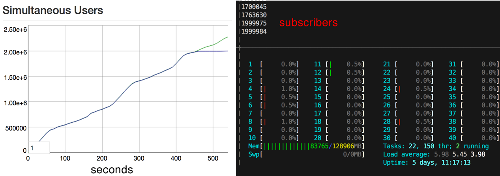

# Introdução ao Elixir

- Elixir é uma linguagem de programação funcional, concorrente, linguagem de propósito geral que roda Erlang virtual machine (BEAM). Desenvolvida por um brasileiro "José Valim - Plataformatec".  

fonte: https://en.wikipedia.org/wiki/Elixir_(programming_language)

- Erlang é apenas a linguagem (VM) por trás do Whatsapp, 50 engenheiros para 90 milhões de usuários. 

fonte: 
https://www.wired.com/2015/09/whatsapp-serves-900-million-users-50-engineers/
https://www.fastcompany.com/3026758/inside-erlang-the-rare-programming-language-behind-whatsapps-success

- Erlang code - ugly


- Elixir - sintaxe mais amigável


- Phoenix "roubou" diversos desenvolvedores Rails. As similaridades de sintaxe do Elixir com o Ruby e as características de alta concorrência e escalabilidade providas pelo Erlang, tornaram o Elixir/Phoenix uma evolução natural para os desenvolvedores Ruby/Rails.

fonte: https://smashingboxes.com/blog/choosing-your-future-tech-stack-clojure-vs-elixir-vs-go/

- 2 milhões de WebSocket conexões com Phoenix



fonte: https://phoenixframework.org/blog/the-road-to-2-million-websocket-connections

Este material é baseado https://elixirschool.com/en, versão em Português https://elixirschool.com/pt (pode estar desatualizada)

# Instalação

Seguir o guia da página oficial https://elixir-lang.org/install.html ou https://elixirgirls.com/install-guides/windows.html

# Shell - iex

```elixir
iex(1)> 2 + 3
5
iex(2)> 2 + 3 == 5
true
iex(3)> String.length("UFRA - ICIBE")         
12
```

